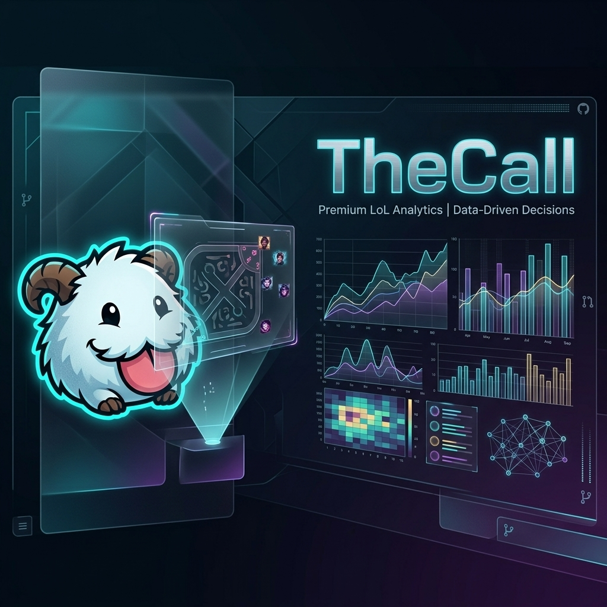

<p align="center">
  
</p>

<h1 align="center">TheCall</h1>

<p align="center">
  <strong>Le coaching post-game, réinventé.</strong><br>
  <em>Post-game coaching, reinvented.</em>
</p>

<p align="center">
  
  
  
  
  
</p>

---

## 🌟 Overview / Présentation

**TheCall** is a premium post-game analysis platform for League of Legends. It leverages AI to transform complex raw data into actionable, easy-to-understand coaching reports. Designed for players from Bronze to Gold, it pinpoints exactly where the game turns and provides a clear plan for your next match.

**TheCall** est une plateforme d'analyse post-game premium pour League of Legends. Elle utilise l'IA pour transformer les données brutes complexes en rapports de coaching actionnables et clairs. Conçu pour les joueurs de Bronze à Gold, le service identifie exactement où la partie bascule et propose un plan d'action concret pour le prochain match.

---

## 🛠️ Key Features / Fonctionnalités Clés

### 🇬🇧 English
- **The "Key Moment" (Moment Clé)**: Identify the exact timestamp when the game tilted in favor of the enemy and understand why.
- **Root Cause Analysis**: Go beyond "playing badly" to find the structural issues (Tempo, Vision, Objective priority).
- **Next Game Action Plan**: One simple, concrete instruction to apply immediately in your next game.
- **Visual Analytics**: Interactive Win Probability graphs and detailed role-specific performance metrics (Macro, Laning, Decisions).
- **Premium UI**: Experience a sleek, futuristic interface featuring Glassmorphism, Three.js backgrounds, and smooth GSAP animations.

### 🇫🇷 Français
- **Le "Moment Clé"** : Identifiez l'instant précis où la partie a basculé et comprenez pourquoi.
- **Analyse de Cause Racine** : Allez au-delà du simple "mal joué" pour trouver les problèmes structurels (Tempo, Vision, Priorité objectifs).
- **Plan d'Action Prochaine Partie** : Une consigne simple et concrète à appliquer immédiatement.
- **Analytiques Visuels** : Graphiques de probabilité de victoire interactifs et scores détaillés par rôle (Macro, Laning, Décisions).
- **Interface Premium** : Profitez d'une UI futuriste avec effets de Glassmorphism, fonds d'écran Three.js et animations fluides GSAP.

---

## 💻 Tech Stack / Stack Technique

- **Frontend**: [Next.js 16 (App Router)](https://nextjs.org/), [React 19](https://react.dev/), [Tailwind CSS 4](https://tailwindcss.com/)
- **Visuals & Motion**: [Three.js](https://threejs.org/), [Framer Motion](https://www.framer.com/motion/), [GSAP](https://gsap.com/)
- **Backend & Database**: [Prisma](https://www.prisma.io/) with [PostgreSQL](https://www.postgresql.org/), [Upstash Redis](https://upstash.com/) for caching
- **AI Engine**: [OpenAI API](https://openai.com/) for intelligent match auditing
- **Infrastructure**: [Stripe](https://stripe.com/) for payments, [Sentry](https://sentry.io/) for monitoring
- **State Management**: [Zustand](https://github.com/pmndrs/zustand)

---

## 🚀 Getting Started / Démarrage

### Prerequisites
- Node.js 18+
- PostgreSQL
- Upstash Redis account (or local Redis)
- OpenAI API Key

### Installation

1. **Clone the repository**
   ```bash
   git clone https://github.com/benjii66/thecall.git
   cd thecall
   ```

2. **Install dependencies**
   ```bash
   npm install
   ```

3. **Database Setup**
   Configure your `DATABASE_URL` in `.env.local` and run:
   ```bash
   npx prisma generate
   npx prisma db push
   ```

4. **Environment Variables**
   Create a `.env.local` file based on the provided examples.

5. **Run Development Server**
   ```bash
   npm run dev
   ```

---

## 🧪 Testing / Tests

The project maintains high reliability through a comprehensive testing suite:

- **Unit Tests**: `npm test` (Jest + React Testing Library)
- **E2E Tests**: `npm run test:e2e` (Playwright)

---

<p align="center">
  Crafted with ❤️ by <strong>BNJ</strong> and the TheCall Team.
</p>
